# Predavanja 1
ARS
- Kako deluje pc?
- Arhitektura vs Oganizacija racunalnika

## Arhitektura
Računalnik, ki ga programer vidi na nivoju strojnega/ zbirnega jezika (MC, ASM)

Nekoc so programiral v asm, zdaj ne vec
v mnogih podrocjih kje dobro da poznas "low level" -> zelo pomembno videti, kaj se dogaja na nizkem nivoju.

**Računalnik, kot ga vidi programer (compiler) na nivoju strojnega jezika**

**ISA** -> instruction set architecture
- nabori ukazov

## Organizacija
kako je zgrajen računalnik, kako sestavni deli delujejo, kako so povezani med seboj -> **mikro arhitektura**

isto arhitekturo lahko naredis z razlicnimi organizacijami

## Kaj je računalniška arhitektura?

<table>
    <tr><td>Aplikacija</td></tr>
    <tr><td>Algoritem</td></tr>
    <tr><td>Programski jezik</td></tr>
    <tr><td>Zbirni jezik</td></tr>
    <tr><td>Ukazna arhitektura (ISA)</td></tr>
    <tr><td>Mikro arhitektura</td></tr>
    <tr><td>RTL</td></tr>
    <tr><td>Logična vrata</td></tr>
    <tr><td>Naprave</td></tr>
    <tr><td>Fizika</td></tr>
</table>

RTL -> Register Transfer Language
na nivoju registrov, iz tega reg gre v ta reg,...

Aplikacije vedno zahtevajo, da se arhitektura izboljša -> financirajo razvoj arhitektur -> boljša vezja, tranzistorji...
Vse to vpliva, kako bo apl delala

Tehnologije omejujejo, kako učinkovito bo aplikacija delovala

## Ocenjevanje
Obveznosti:
- 2 Kolokvija -> ocena vaj
    - \>= 30% povprecje, vsak \>=20% -> pogoj za pristop
    - če je avg obeh >=60% -> steje kot opravljen pisni izpit
- Ocena:
    - 1/3 vaje(kolokviji)
    - 1/3 pisni
    - 1/3 teorija
- Prvi kol: **2.4.26@17h ali 18h**

## Razlogi za strojno racunanje
Računanje "peš" je počasno, in se lahko zmotiš oz. je nezanesljivo

Povezava med obema?
Ročno rešujemo na papir, kar na nek nacin predstavlja pomnilnik. Možgani so neke vrste processor, ki nam pomaga računat. Na papirju lahko imamo 2 stvari: navodila za računanje (ukazi) npr x in operande (st, ki jih hocem zmnozit) npr 23, 45; pa izhodne operande in vmesne korake

<table>
    <tr><td>Navodila za računanje -> ukazi-> <b>UKAZNI POMNILNIK</b></td></tr>
    <tr><td>Operandi<br/>(23,45) -> <b>OPERANDNI POMNILNIK</b></td></tr>
</table>

Možgani opravljajo 2 funkciji:
1. Nadzor
   Npr: izracunal sm prvi rezultat, sedaj moram drugega,...
   pri pc to opravlja **Kontrolna enota** -> nadzor med racunanjem "sef"
2. Računanje
   pri PC to pocne **ALU** -> "delavec"

### Rocno racunanje
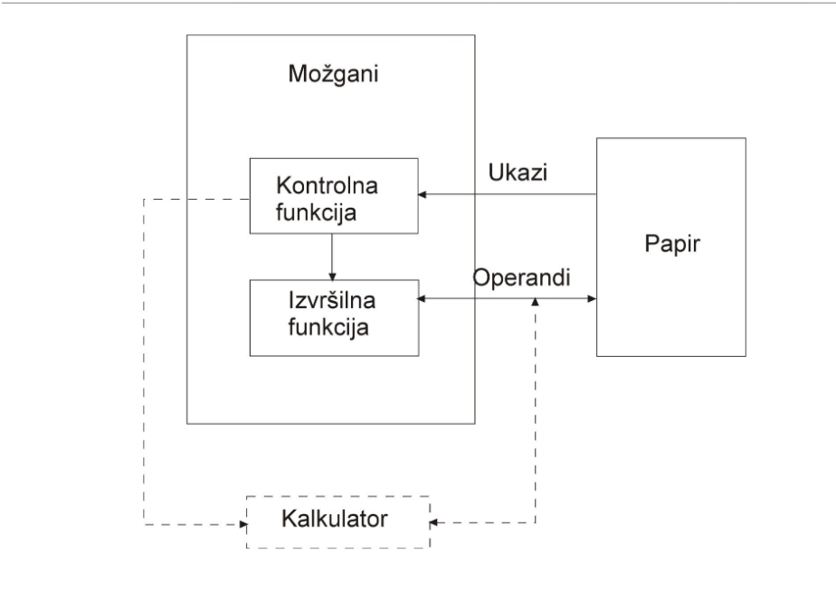

### Strojno racunanje
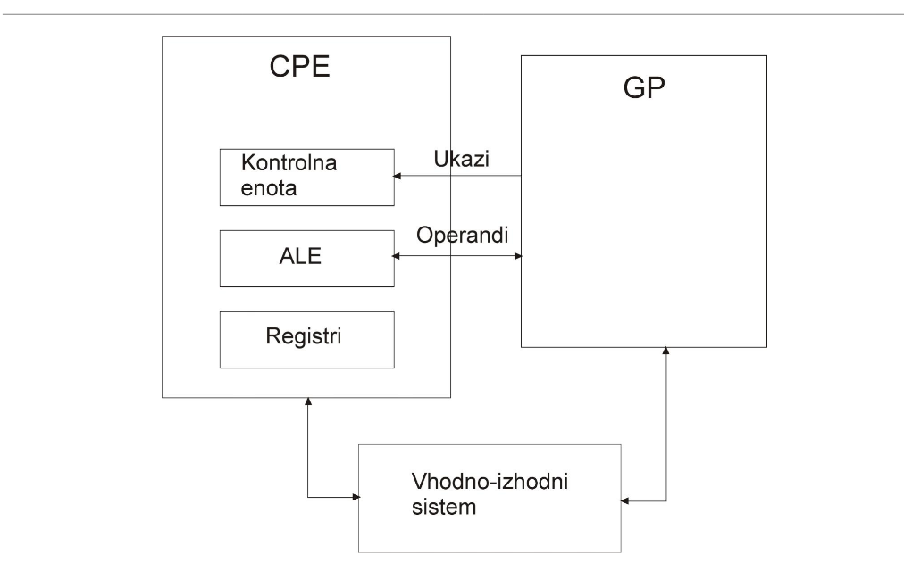
Registri -> hitri pomnilnik, jih rabimo, za pomnenje podatkov.
Zakaj reg? -> Hitrejsi kot GP in blizje je CPU. Prometu z GP se provamo izogibati
Disk se steje kot I/O naprava, saj je dostop do diska bistveno počasnejši kot do pomnilnika

## Zgodovina računalništva
### Digitalni princip
- digit -> prst/stevka
    fizikalna velicina je diskretno predstavljena z števili
omejeno št stanj 0,1

zakaj je 0 in 1 lazje prenasat? -> je bolj robustno.
2 stanji:

<table>
<tr> <td>5V</td> <td>1</td>
</tr>
<tr><td>3.5V</td><td rowspan=2>Prepovedano stanje</td></tr>
<tr><td>1.5V</td></tr>
<tr><td>0V</td><td>0</td></tr>
</table>

natančnost se poveča z **dodajanjem bitov** oz. **binarnih mest**

### Analogni princip
zvezno št. stanj -> neomejeno število, težava z natančnostjo
ni omejeno
- zakaj danes ni vec analognih racunalnikov?
    - shranjevanje in prenos podatkov -> shranjen kot neka velicina, natancnost. Tezko posiljanje -> niso odporni na sum
    - kompleksnost

primer: logartimično računalo

### Obdobje mehanike
1. Prvi calculatorji
Klakulator je naprava, ji izvaja aritmeticne operacije. Prvi so izvajali le osnovne operacije. ~17.stol

2. Charels Babbage
    si je zamislil kako narediti racunalnik
    ~19. stoletje
    2.1 Diferenčni stroj
    2.2 Analitični stroj 1835
    zgradba:
    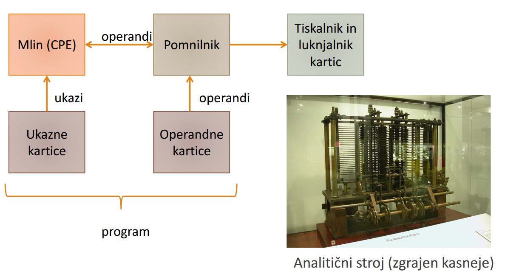
    Kaj so luknjane kartice?
    Luknja eno stanje, brez luknje drugo stanje

3. Elektromehanski stroj
    elektromotorji za pogon
    - relay 
      - naprava, ki deluje tako, da ce spustimo tok skozi tuljavo, nastane magnetno polje. Mag sila nato pritegne switch k sebi
      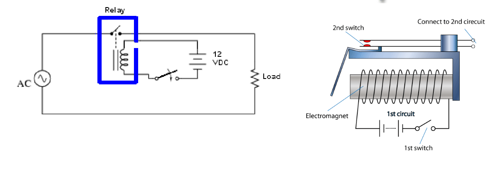
4. Konrad Zuse
   - prvi delujoči računalnik 1938
   - 2600 relayev
   - 64 besedni 22b pomnilnik
   - 8b ukazi
   - luknjan trak
   - fp
   - tipkovnica
   - ni imel pogojnih skokov (if, while, for)
   - freq: 5 - 10Hz
   - Uničen med bombardidanjem berlina
   - Zgradba:
        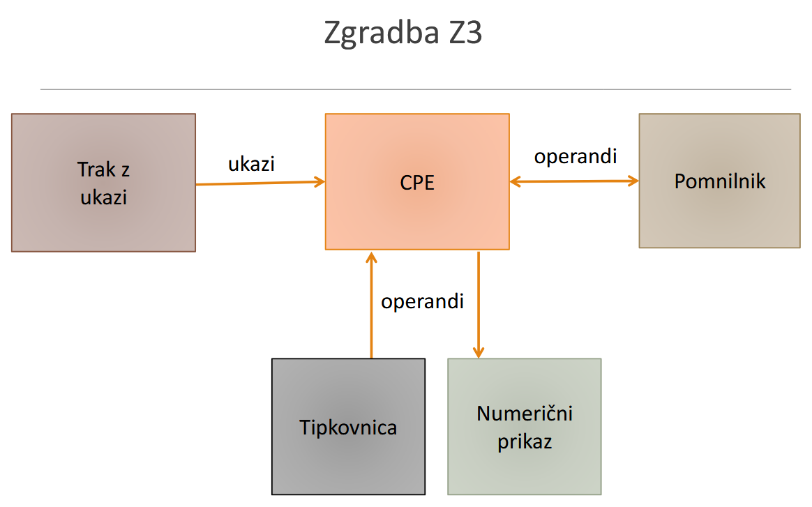

5. Harward Mk1
  - 1943 IBM
  - Ukazi oblike A1 A2 OP -> pom naslova + operacija, vsi 8b
Elektromehanski stroji so bili uresničitev zamisli Babbagea. Nejihov problem je mehanika, ki omejuje hitrost in zanesljivost.

Pojavi se elektronika -> **ELEKTRONKA**
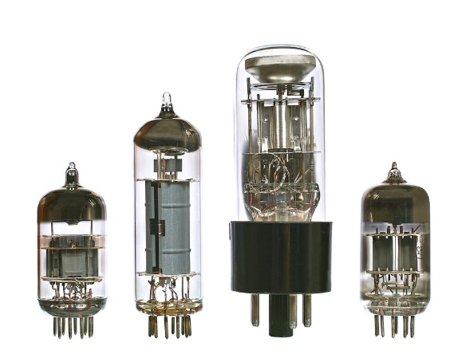
noter je zaprta, naplnjena z plinom, ki prevaja tok. Nadomesti relaye.

Leta 1947 izumijo **TRANZISTOR**, ki je nadomestil elektronke

1. ENIAC
   - Electronic Numerical Intergrator And Calculator
   - 4k Elektronk
   - pocasen
   - ročno programiranje ~ 6k stikal -> zzzelo zamudni
   - 1.5k relayev, 18k elektronk 140kW, 30m, 30t
   - ker je programiranje lahko trajalo vec dni, so razmisljanli o shranjenem programu -> **Von Newman**

2. Elektronski računalniki s shranjenim programom
   - Prednost: Hitrejše računanje, dostop do ukazov in operandov je hiter. Program lahko kot svoj input podatek vzame drug program in ga spremeni v tretjega (compiler).
   - Npr. compiler dobi program v C, ki ga nato pretvori v machine code

### razvoj po letu 1950
Komercialni interes, serijska proizvodnja, nizje cene

tranzistor:
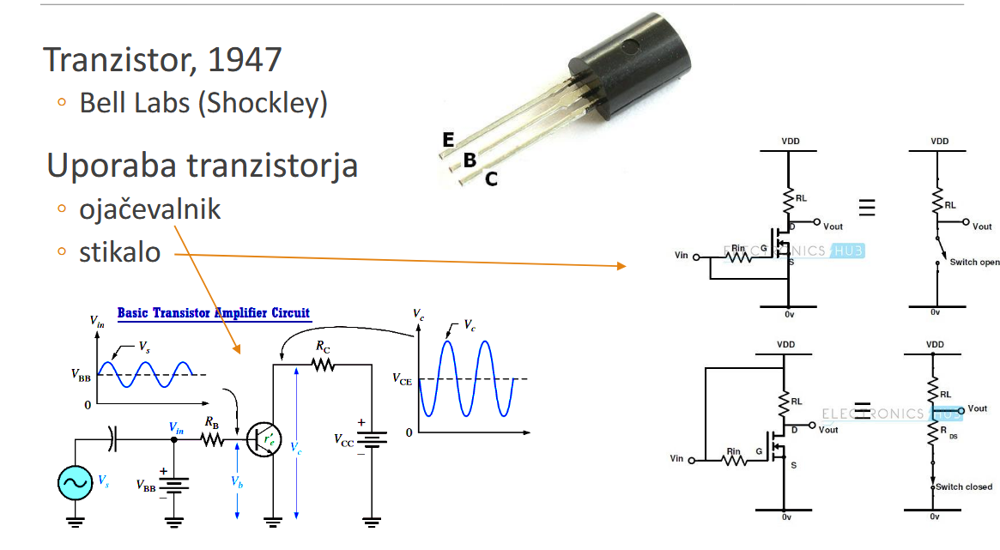

tranzistor kot stikalo: najbolj rabljen v računalništvu
deluje tako, da skozi njega posljemo nek tok. Ce damo na njega 1, bo prevajal, zato dobimo 0.
Ce na in damo 0 ne bo prevajal, ne pride do padca napetosti, zato bomo imeli log 1.

Intergrirana vezja
Silicijeva rezina -> **wafer**, na njih je vec cipov

**Moorov zakon:**
Na vsakih 18 mesecov se podvoji st. tranzistorjev na cipih, s tem da porabijo enko energije

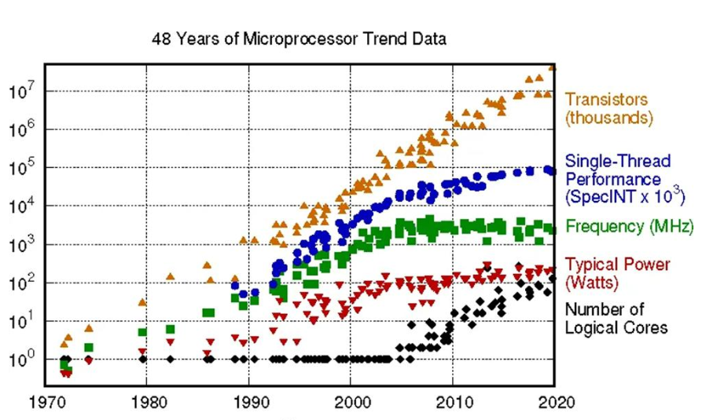

veljal nekje do leta 2000.

### Denarovo skaliranje
Z zmanjšavanjem dimenzij tranzistorjev ostane proaba energije na povrsino konstanta. Toplote se ne da dovolj hitro odvajati, da bi stvar delovala -> prihaja do pregrevanja.
Stagnacija pri zmogljivosti od 2005. Problem je Leakage Current.

### Današnji računalniki
Namizni, prenosniki, tablice, serverji, supercomputers, embeded systems (telefoni, konzole, gos. aparati,...)

embeded systems: računalniki, ki so del neke večje enote in služijo nekemu namenu

### razvoj programiranja
programiranje z vpisovanjem 0 in 1.

nalaganje programa iz zunanjega v glavni pomnilnik -> bootstrap oz bootloader -> **zagon OS**

Simbolični zapis: Zbirni jezik oz. **Assembly language**

Zbirni jezik:
Je zapis ukazov v obliki:
```asm
ADD R1, R2, R3
```

Zbirnik (Assembler):
Je program, ki zbirni jezik spremeni v strojno kodo
pretvorba je 1:1

Knji#nice numeričnih podprogramov (procedur)

Visji programski jeziki v 60. letih:
Fortran 1956, ALGOL, COBOL, LISP,...
kasneje: C, Pascal, C++, Java, Python,...

Primerjava:
koda v zbirnem jeziku je hitrejsa, programiranje v njem je pocasnejse

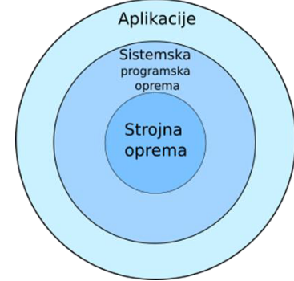

Orodja: OS, zbirniki, nalagalniki, linkerji, compilers,...

V zgodnjih 60. letih je imel IBM 4 vrste nekompatibilnih računalnikov
IBM 360 ISA prvi prenosljivi instruction set

## Osnovni principi delovanja racunalnikov

### Von neumanov računalniški model
<span style = "color: purple">Izpitno vprasanje: Kako je definiran VN model</span>
1. Sestavljajo ga
   1. CPU
   2. Glavni pomnilnik
   3. I/O system
2. Ima program shranjen v Glavnem pomnilniku
3. **CPU jemlje ukaze programa iz GP in jih zaporedoma izvšuje**

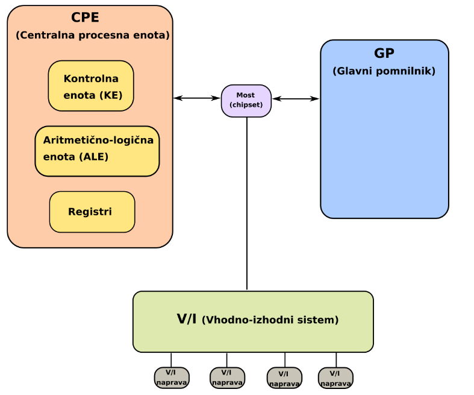
North brighre: Hitre povzezave
South bidge: pocasnejse povezave kot I/O

**Glavni deli vn racunalnika**
1. CPU
   1. Mikroprocessor
   2. vodi dogajanje v racunalniku
   3. naloga je jemanje ukazov iz pom. in njihovo izvrševanje
   4. Delimo na 3 dele
      1. **kontrolna enota**
           - prevzem ukazov in operandov
           - aktiviranje operacij
      2. ALU
           - izvršuje večino ukazov
      3. Registri
         - začasno shranjujejo podatke
2. Glavni pomnilnik
   - V njem so shranjeni ukazi in operandi
   - sestavljajo ga pom besede, vsaka ima svoj naslov
    <table>
    <tr><td>naslov</td><td colspan=8>8b besede</td></tr>
    <tr><td>0</td><td></td><td></td><td></td><td></td><td></td><td></td><td></td><td></td></tr>
    <tr><td>1</td><td></td><td></td><td></td><td></td><td></td><td></td><td></td><td></td></tr>
    <tr><td>n-1</td><td></td><td></td><td></td><td></td><td></td><td></td><td></td><td></td></tr>
    </table>  
    - tehnologija dram
3. IO sistem
   - prenos info iz in v zunanji svet.
   - Fizično najvidnejši del računalnika
   - pretvarjajo info v obliko priperno za človeka ali druge naprave 

### uakz
<table>
<tr>
    <td>op. koda</td><td colspan=6>informacija o operandih</td>
</tr>
<tr>
<td>op. koda</td><td></td><td></td><td></td><td></td><td></td><td></td></td>
</tr>
</table>

npr 32b ukaz v 8b pom:
zavzame 4 pom besede 32 / 8
ukazi so zapisani v sosednjih lokacijah, saj ce ne bi bile, bi morali imeti dva naslova, da vemo kje se ukaz nahaja

**format ukaza** -> pove, kako so biti ukaza razdeljeni na op. kodo in operande
<table>
<td>31...26</td><td>25...21</td><td></td>
<tr>
    <td>op. koda</td><td>op 1</td><td>...</td>
</tr>
<tr>
</tr>
</table>

pri vsakem ukazu sta 2 koraka:
1. Prevzem ukaza iz pom (**fetch**)
   - to so ukazi strojnega jezika oz strojni ukazi.
   - bere pom. naslove iz PC (program counterja). PC je register v CPU, v katerem je zapisan naslov ukaza, ki se bo naslednji izvedel

2. Izvrševanje ukaza (**execute**)
   - ukaz opazuje operacijo in operande
   - CPU (običajno ALU) ukaz izvrši
   - PC se poveča: PC += (dolzina ukaza / dolzina. pom besede), razen pri **skočnih ukazih**

**prekinitve**
zaporedje teh 2 korakov se pondavlja vec cas delovanja pc
izjema so prekinitve (**interrupts**) in pasti (**traps**)
te interupre je treba handle-at -> interrupt handling
past: program sam zahteva klic syscall alpa Exceptions. Prihaja "od znotraj".
Takrat se izvrsi jmp na prvi ukaz **prekinitvenega servisnega programa PSP**. Je ze vnaprej napisano/ znano.
Pri tem se shrani vrednost PC

**gralvni pomnilnik**
pasiven
za zmogljivost pc, je pomembno da se med CPU in RAM prenese dovolj info. -> ozko grlo VN racunalnika **bottle neck**
ena od resitev je **Harwardska arhitektura** -> pom za ukaze in pom za operande
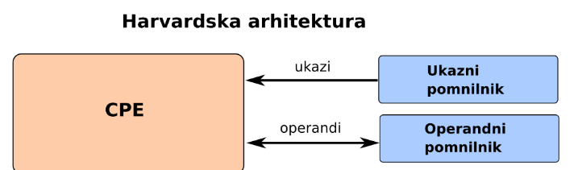

Princetonska arhitektura:
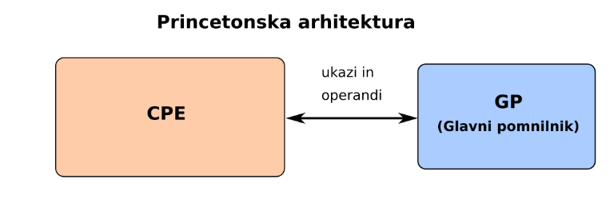

dandanes ne ena ne druga nista direktno v uporabi.
Danes se rabista predpomnilnika **cache**:
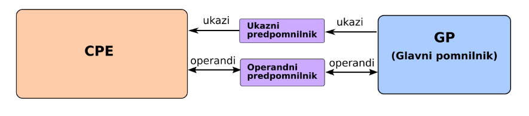