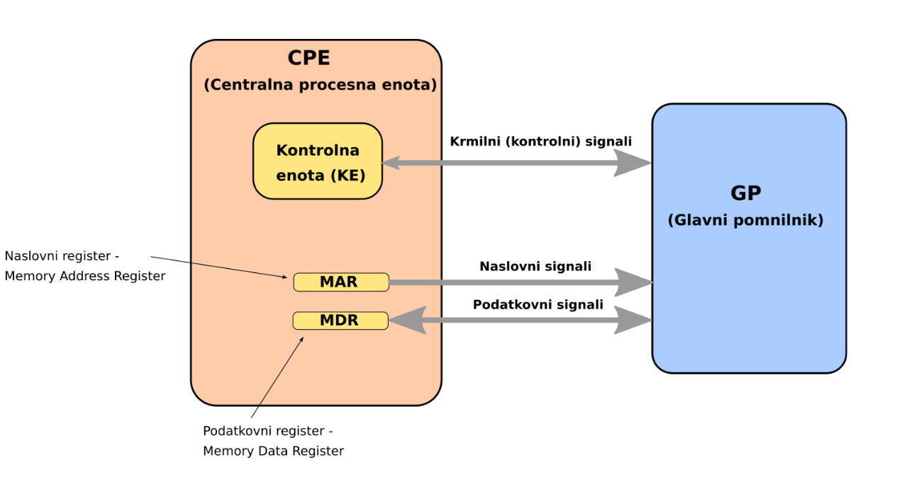
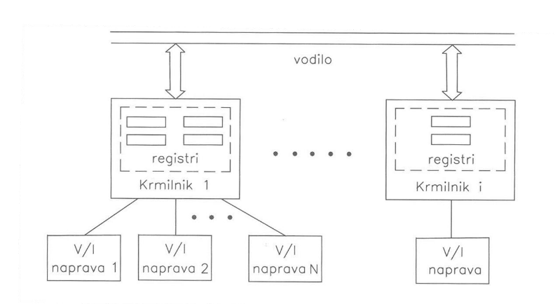
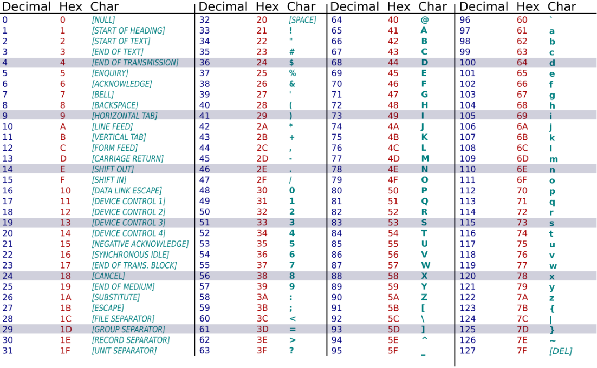
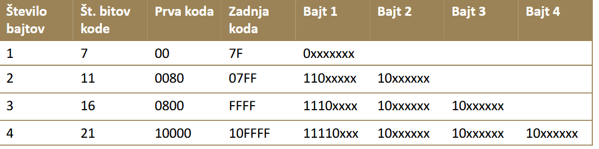
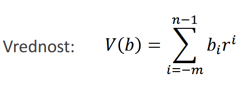
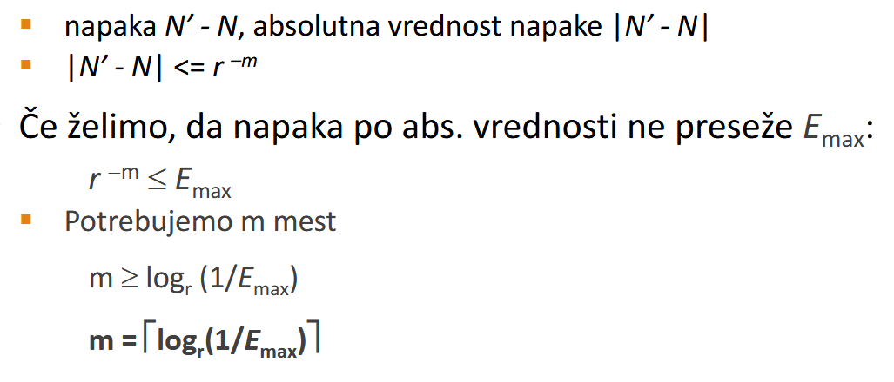
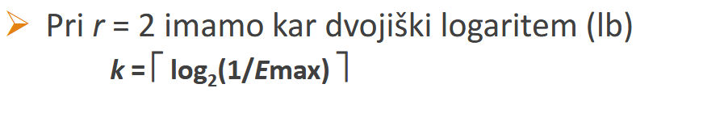

# Predavanje 2 electric boogaloo
RAM:
- pom. beseda
    - index bita
kazalo: 2^n-1

v pom. besedo lahko zapisemo 8b. lahko damo 2^n naslovnih vsebin

## CPU
Kontrolni signal > read / Write koliko bitov
ALU
MAR -> Memory address register (naslovni register)
- vsebuje naslov pom besede
MDR -> Memory data register
    - koliko bitov lahko naenkrat pride

**Vodila**
- kontrolno
- naslovno
- podatkovno

CPU:
<table>
    <tr><td> </td><td>KE</td><td> </td></tr>
    <tr><td></td><td>ALU</td><td></td></tr>
    <tr><td></td><td>MAR</td><td></td></tr>
    <tr><td></td><td>MDR</td><td></td></tr>
</table>

## I/O
CPE -> RAM
povezan z obema -> I/O
osnovni namen: prenasanje information

Skupine I/O
1. PIO: program I/O
    - tezava: pocasnost -> cpu je zaseden -> OBREMENJUJE CPU

2. DMA -> direct mem. access
    - pomnilnik neposredno dostopa do data
    - Dma controller-> skrbi za komunikacijo/ pomozna CPU
    - prenos veliko podatkov

vsaka I/O ima krmilnik I/O naprave

### registri krmilnikov so lahko:
1. V istem naslovnem prostoru
    - pomnilniško preslikan I/O oz. Memory mapped I/O MMIO
    - Do registrov dostopamo kot do obicajnega mem
2. V locenem naslovnem prostoru
    - npr. Intel
    - posebni ukazi za branje pa pisanje registrov
3. posebno preko I/O processorjev -> vecji racunalniki

## Compiling vs Interpretation
Računalnik kot zaporedje virtual pc
Tonenbaunm (mayhaps narobe napisan) 1984
2 mehanizma prehoda med nivoji
1. Prevajanje (compilation)
    - compilers
    - izvorni program v enem jeziku, ciljni pa v drugem
    - izvornega programa teoreticno ne bi vec rabil
2. Interpretiranje
    - izvornu program se izvršuje ukaz po ukaz
    - skriptni jeziki: python, perl,... 
3. Kombinacija obojega
    - java
    - prevede se v nek intermidiate language, ki se interpretira v posebnem stroju
    - ne bo tako ucinkovito kot npr. C ali cpp

### oprema racunalnika
1. hardware
2. software
3. firmware

>[!NOTE]
> brez software-a ni hardware-a in brez hardware-a ni software-a
>

## info v pc
- ukazi
- operandi
    - numerični
        - fixed point
            - signed / usigned
        - floating point
            - enojna/ dvojna natancost
    - ne numericni
        - logicne var
        - chars

## ASCII
7b abeceda
8b -> razsirjena

## unicode
- UTF-8
- UTF-16
- UTF-32

## Numericni operandi v fixed point
192,73 = 1*10^2 + 9*10^1 + 2*10^0 + 7*10^-1 + 3*10^-2

pretvorba v poljubno bazo:

 

## napaka pri rezanju decimalk
kadar st n odrezemo na m mest desno od vejice dobimo priblizek N'

### pretvorba med poljubnima bazama
1. pretvorimo v 10
2. iz 10 v r

Kadar sta bazi **sorodni** (oba veckratnika istega st), je pretvorba lazja
npr 2 4 8

### unsigned numbers
z n biti lahko zapisemo uints od 0 do 2^n-1
Kadar rezultat preseze velikost stevila, se pojavi carry

### zapisi signed ints
1. Predznak-veličinskih zapis (PV)
    - prvi bit predstavlja predznak, ostali velikost
    - npr: ``0 1 0 1`` -> +5
    - ni primeren za plusiranje in minusiranje
    - primeren za mult/div
    - predznak je xor

2. Predstavitev z odmikom (PO)
    - odmik je ovbicajno $2^{n-1}$
    - izracun: $\sum_{i = 0}^{n-1}{b_i2^i-2^{n-1}}$
    - nekoc priljubljen zapis
    - pri add je treba odmik pristet pri sub pa odstet

3. Eniski komplement
    - $V(B) = \sum_{i = 0}^{n-1}{b_i 2^i - b_{n-1}(2^n-1)}$
    - $b_{n-1}$ je predznak
    - negativno st dobimo iz poz z invertiranjem vseh bitov
    - predzanka ni treba obravnavati posebej
    - pri prenosu z max mesta je treba na LSB pristeti 1
