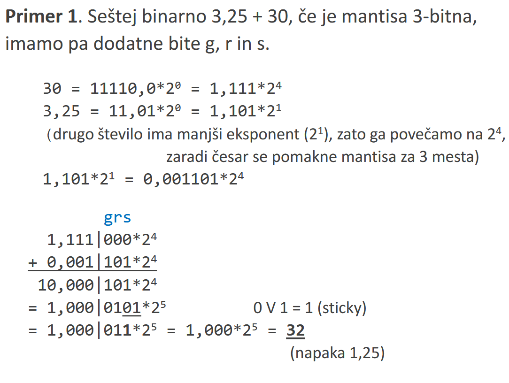
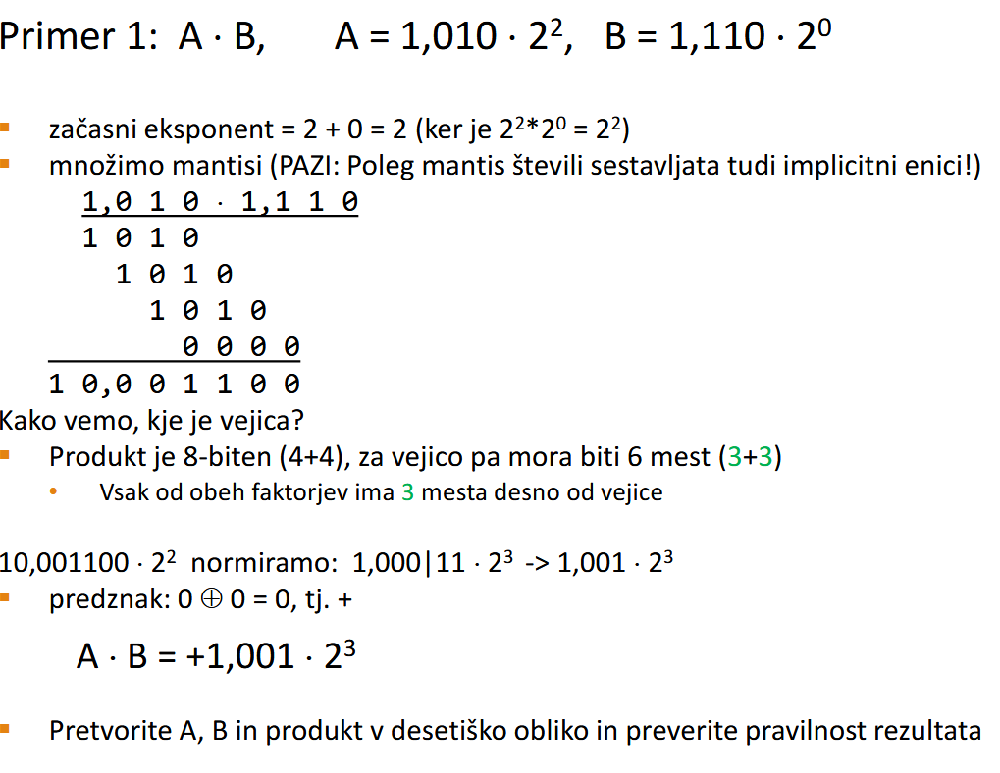
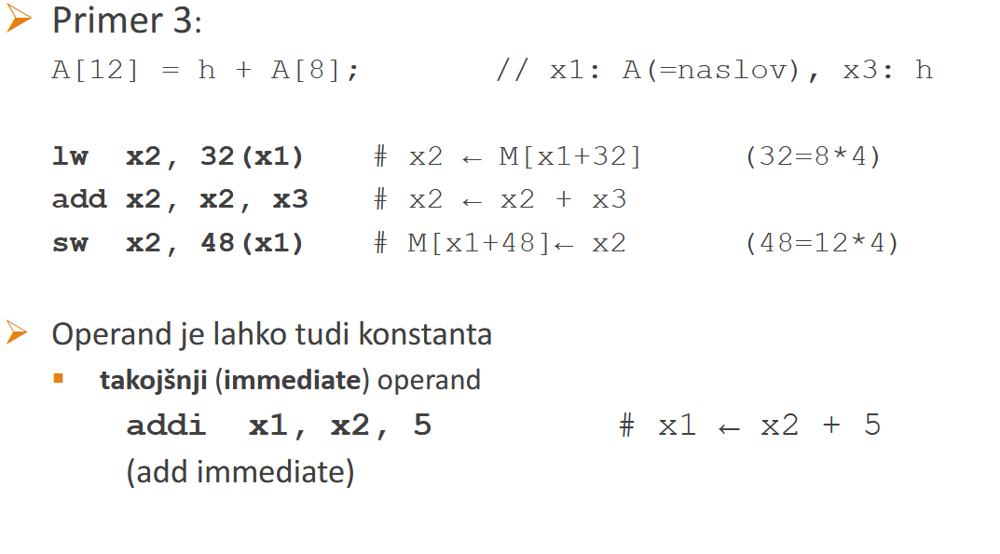

# pred 4
## denormirana st
najmanjse norm stevilo?
E za norm od 1 - 254
min st: E = 0000 0001
<table>
<tr>
    <td>0</td><td>0000 0001</td><td>00...0</td>
</tr>
<tr>
    <td>sign</td><td>E</td><td>m</td>
</tr>
</table>

$$
(-1)^{\text{sign}} \cdot 1,m\cdot2^{E-127}
$$

sepravi min st je: $1,0... \times 2^{1-127} = 1,0*2^{-126}$

se manjsa stevila so **denormirana stevila**

```math
V = (-1)^{s} \times 0,m \times 2^{-126}\\
\text{E} = 2^{8-1} - 2
```
<table>
<tr>
    <td></td><td>0000 0000</td><td></td>
</tr>
<tr>
    <td>sign</td><td>E</td><td>m</td>
</tr>
</table>

za **double precision** je pa $(-1)^s \times 0,m \times 2^{-1022}$
$\text{E} = 2^{11-1} - 2$

tudi nicla je denormirano stevilo z mantiso 0:
+0 so same nicle v zapisu
-0 je sign 1 in ostalo je nic

### neskoncnosti in NaN
E: same enice
<table>
<tr>
    <td></td><td>1111 1111</td><td></td>
</tr>
<tr>
    <td>sign</td><td>E</td><td>m</td>
</tr>
</table>

$E = 255 = 2^8 - 1$

ce je m = 0 -> $\pm \infin$, predznak odvisen od znaka
ce je m $\neq 0 \rightarrow$ NaN -> Rezultati: 0/0, $\infin - \infin$, $\infin \times 0$, $\sqrt{-4}$. Če je vsaj 1 vhodni op. NaN = res = NaN

## Aritemtika v fp
### Rounding
od mat natančne vrednosti k najbližjemu se predstavljivemu številu
ce je vrednost enako oddaljena od 2 predstavljivih stevil, vzamemo **sodo** (obicajno)

##
mantiso pri racunanju podaljsamo za 3b
- Varovalni bit (guard bit) -> vsota ke za 1b vecja od operandov (prvi bit za LSB)
- Zaokroževalni bit (round bit) -> ni nujni potreben -> 2b za LSB
- lepljivi (sticky) bit -> logični OR vseh bitov (če je vsaj 1b 1 bo dal 1)-> je za bitom r

<table>
<tr>
    <td>q</td><td>r</td><td>s</td><td>round</td>
</tr>
<tr>
    <td>0</td><td>x</td><td>x</td><td>dol</td>
</tr>
<tr>
    <td>1</td><td>1</td><td>x</td><td>gor</td>
</tr>
<tr>
    <td>1</td><td>0</td><td>1</td><td>gor</td>
</tr>
<tr>
    <td>1</td><td>0</td><td>0</td><td>k sosedu</td>
</tr>
</table>

### sesetevanje v fp
- prvi st naj bo tisto z vecjim exponentom -> začasni exponent
- drugemu premaknemo mantiso tako, da bo imelo isti exponent kot prvo
- sestevanje / odstevanje mantis
- ce pride do premosa, premik za 1 in povečaj začasni exponent za 1
- zaokrožimo mantiso


### mnozenje v fp
- potrebnih je vec ciklov ure
- exponenta sestejemo
- mantisi zmnozimo z mnzoilnikom
- po potrebi normiramo res
- predznak producta je xor obeh predznakov

### deljenje
- odstevanje exponentov
- dejlenje mantis

# Assembly

## RISC-V
visji programski jeziki $\xrightarrow{\text{prevajalnik}}$ zbirni jezik $\xrightarrow{\text{zbirnik}}$ machine code

ali

visji prog prezik $\xrightarrow{\text{prevajalnik}}$ machine code

registri cpu
x5
x6
x7

```C
int a, b = 1; c = 2;
a = b + c;
```

compiled:

```assembly
add     x5,x6,x7 #x5 <-x6 + x7
```



risc: reduced instruction set computer
cisc: complex instruction set computer

### RISC-v je družina
- RV32I -> registri so 32b
- RV64I -> reg in naslovi so 64b
- RV128I -> reg in nas 128b
- RB32E -> embeded

### Razširitve
- M mnozenje
- F foating point
- D fp double
- A atomski uzakzi -> ukazi ki se izvrsijo v celoti cene pa ne

##
RISC-V ima 32 splosno namenskih registrov
x0 ... x31
x0 je fiksno vezan na 0

### vecina ukazov ima 3 eksp. operande
- 3 registri
- 2 reg + 1 takojsni operand

### load / store ukazi
dostop do pomn operandov samo preko lda / store

### Little Endian Rulle
pravilo tankega konca
lsb je na najnizjem naslovu
<table>
<tr><td>0000</td></tr>
<tr><td>....</td></tr>
<tr>
    <td> LSB </td>
</tr>
<tr>
    <td> MSB </td>
</tr>
<tr><td>....</td></tr>
<tr><td>FFFF</td></tr>
</table>

### poravnanost
vsak operand mora biti na takem naslovu da je deljiv z njegovo velikostjo v B oz. dolzino v pom. besedah.

16b -> deljiv z 2
32 -> deljiv z 4

v RISCV poravnanost **ni obvezna, vendar je zazelena**. Ce ni poravnan, sta potrebna 2 dostopa

### 4 vrste ukazov
1. prenost podatkov
   - load / store
   - uporabljajo format I
   - format pove kko so biti v ukazu urejeni
        <table>
        <tr>
            <td>31-20</td><td>19-15</td><td>14-12</td><td>11-7</td><td>6-0</td>
        </tr>
        <tr>
            <td>imm</td><td>rs1</td><td>func tree</td><td>rd</td><td>op code</td>
        </tr>
        <tr>
            <td>12</td><td>5</td><td>3</td><td>5</td><td>7</td>
        </tr>
        </table>
    - ``load rd, imm(rs1)``
    - ``load x5, 30(x6)``
    - v bin:
        <table>
        <tr>
            <td>31-20</td><td>19-15</td><td>14-12</td><td>11-7</td><td>6-0</td>
        </tr>
        <tr>
            <td>000000011110</td><td>00110</td><td>010</td><td>00101</td><td>00000011</td>
        </tr>
        <tr>
            <td>12</td><td>5</td><td>3</td><td>5</td><td>7</td>
        </tr>
        </table>
    - v hex: 0x01E32283
2. ALU
3. Kontrolni ukazi
   - jmps
4. system ukazi
    - upilvajo na nacin delovanja pc